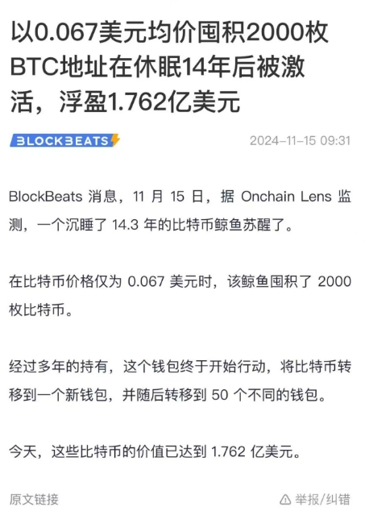
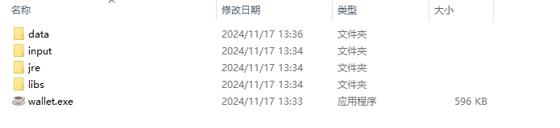
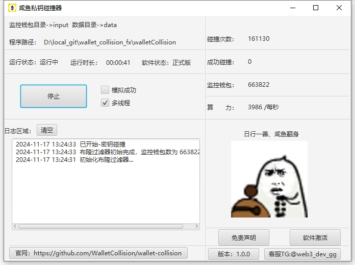
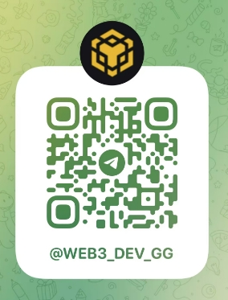

	

<h4 align="center">咸鱼私钥碰撞器</h4>

寓意：逆境翻盘，咸鱼翻身

 	  
      
      
      
      
      
 

##  1.项目简介

大家是否经常有看到一些沉睡多年的钱包苏醒异动新闻，往往这些钱包都是早期单价比较低的时候买入忘记助记词了的，这些都是通过助记词碰撞来找回。

本软件通过遵循BIP39协议随机生成12位助记词，然后根据生成后的地址和导入的监控地址比较，如果一样则密钥一样

## 2.适用人群

1.助记词/密钥丢失，现需要找回

2.有闲置电脑的人群（启动让程序自动运行，无需人工守护）

3.佛系运行者，靠的就是运气

大家试想：

一个钱包总共12个助记词，然后每一位助记词都有2048种可能。总数也就是12的2048次方接近宇宙的原子数量了。

按楼主的电脑配置，1秒钟4000次碰撞，一天大概是3.4亿次，虽然离12的2048次方还是差很远。但是至少碰撞了就有机会碰撞上，玩的就是运气。

类似：七星彩大家都知道中奖的概率很低，但是只要购买了才有机会中奖，不然都是纸上谈兵

## 3.安装包

​    联系客服获取安装包 -》在线客服Telegram：<a href='https://t.me/web3_dev_gg' target="_blank" >咸鱼客服 </a>

​    赠送50w监控地址

## 4.软件优势
   1、支持 ETH、BSC、BASE、Polygon、OP、Avalanche 等以太坊虚拟机 (EVM) 链

   2、持续不断迭代更新

   3、监控大额钱包持续更新

   4、支持离线断网运行

   5、价格优势，相比市面上的其他碰撞器价格优化很多

## 5.启动步骤

1.data为数据目录

2.input为监控钱包目录。把需要碰撞的钱包放入到input目录即可

3.如果碰撞成功了，data里面的 SUCCESS_WALLET.txt会保存私钥，可以点击模拟成功来测试

4.然后点击 wallet.exe 运行即可

## 6.界面显示

## 7.联系我们（Telegram）

在线访问：<a href='https://t.me/web3_dev_gg' target="_blank" >咸鱼客服 </a>

